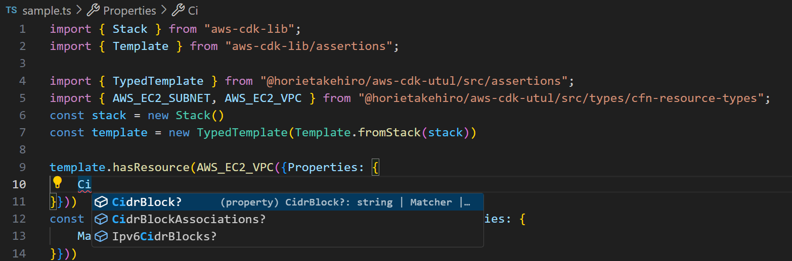

# AWS CDK Unit Test Utility Library

<p align="left">
    <a href="https://www.npmjs.com/package/@horietakehiro/aws-cdk-utul?activeTab=readme" > 
        
   </a>
</p>

**aws-cdk-utul(unit test utility library) makes it faster, more efficient with less mistakes for you to code AWS CDK unit tests.**

---

## Features

---

### TypedTemplate

`TypedTemplate` class provides you proper type definitions for (almost) all AWS CloudFormation resource types. So you can easily and quickly code AWS CDK unit tests without trivial mistakes and googling.



- You can use by just wrapping AWS CDK's `Template` class.
- You can use all methods implemented by AWS CDK's `Template` class with proper type definitions.
- Return values of some methods - e.g. `findResources` - are changed from original ones, so that succeeding processes can handle and access them more easily.
- You can still use AWS CDK's `Matcher` class and other arbitrary objects too.

```js
import { Stack } from "aws-cdk-lib";
import { Template } from "aws-cdk-lib/assertions";

import { TypedTemplate } from "@horietakehiro/aws-cdk-utul/lib/assertions";
import { AWS_EC2_SUBNET, AWS_EC2_VPC } from "@horietakehiro/aws-cdk-utul/lib/types/cfn-resource-types";
const stack = new Stack()

// just wrap an original `Template` instance of aws-cdk-lib/assertions
const template = TypedTemplate.fromStack(stack)
// you can execute all method implemented in original `Template` instance
template.hasResource(AWS_EC2_VPC({Properties: {
  CidrBlock: "10.0.0.0/16"
}}))
// you can still use original `Matcher` class too.
const subnets = template.findResources(AWS_EC2_SUBNET({Properties: {
  Tags: Match.arrayWith([
    {Key: "Name", Value: Match.stringLikeRegexp("Public")}
  ])
}}))
// you can access resources with more efficient way
subnets.forEach((sn) => { 
  expect(sn.def.Properties?.CidrBlock?.endsWith("/24")).toBe(true)
})
```

---

### ExtraMatch

`ExtraMatch` class provides you some kind of a syntax sugar for AWS CDK's `Match` class.

```js
import { ExtraMatch } from "@horietakehiro/aws-cdk-utul/lib/assertions"
// get just vpc's logical id
const [{id}] = template.findResources(AWS_EC2_VPC({}))
template.allResources(AWS_EC2_SUBNET({
  // Equals to {VpcId: {Ref: id}}
  Properties: {VpcId: ExtraMatch.ref(id)}
}))
template.hasOutput("VPCARN", {
  // Equals to {Value: {"Fn::GetAtt": [id, "Arn"]}}
  Value: ExtraMatch.getAttArn(id)
})
```

---

## Install

```bash
npm install @horietakehiro/aws-cdk-utul
```

---

## Some notes

- Schemas of AWS CloudFormation resource types used in this library are based on [those at `us-east-1`](https://docs.aws.amazon.com/ja_jp/AWSCloudFormation/latest/UserGuide/resource-type-schemas.html)
- Compatible with AWS CDK v2.0.0 or greater.
